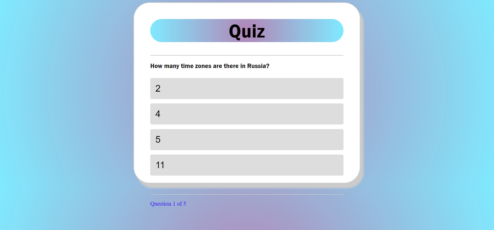

# P2-Quiz
> A simple, fun quiz app.
> Live demo https://charlotteshead.github.io/P2-Quiz/index.html. 

## Table of Contents
- [General Info](#general-information)
- [Technologies Used](#technologies-used)
- [Features](#features)
- [Screenshots](#screenshots)
- [Usage](#usage)
- [Testing](#testing)
- [Deployment](#deployment)
- [Project Status](#project-status)
- [Room for Improvement](#room-for-improvement)
- [Acknowledgements](#acknowledgements)

## General Information
- A quiz game. Nothing more, nothing less. Looks to satisfy the needs of those who like to know if they're smart or not.

## Technologies Used
- Tech 1 - html
- Tech 2 - css
- Tech 3 - JavaScript

## Features
List the ready features here:
- Questions!!
- Multiple choice answers
- Score tracker

## Screenshots
  

## Usage
Upon opening the app one is greeted immediately with the opportunity to begin the quiz. I chose to forgo username and sign-ups as this is often seen as a privacy concern and thus deters many users from such a website. Progress through the quiz is shown throughout the duration of the quiz, but the score is hidden until completion. At this stage, to encourage return visitors, correct answers will not be shown at the end of the quiz but it may be a feature added in the future along with more questions.

## Testing

The website has been tested on multiple browsers on different OS's with no issues found.
It has also been tested on Android and iPhone devices, also clear of issues.

### Development Testing

During the development process, I was manually testing in the following ways:-

 - Manually testing each element for appearance and responsiveness via a simulated live server using an extension in VSCode.
 
 - Pass through Jshint without any issues
 
 - Pass through W3C validator without any issues.
 
 - Pass through Jigsaw validator without any issues.   

 - Published the page via GitHub pages and shared with friends to test and provide feedback.

#### Manual Testing:
During testing, I used multiple different browsers to ensure cross-compatibility. The browsers used by myself were:

- Chrome (desktop & Andriod)
- Firefox
- Internet Explorer
- Safari (Mac & iPhone)

I also used the devtools to simulate different screen sizes/devices down to 320 px in width.

## Deployment

### GitHub Pages

The project was deployed to GitHub Pages using the following steps...

1. Log in to GitHub and locate the [GitHub
   Repository](https://github.com/CharlottesHead/P2-Quiz)
1. At the top of the Repository (not top of page), locate the "Settings" Button
   on the menu.
1. Select "Pages" from the vertical navigation on the left of the page.
1. Under "Source", click the dropdown displaying "None" and select "Main".
1. Click the "Save" button.
1. The link to the deployed page will now be displayed in the "pages" section.

### Forking the GitHub Repository

By forking the GitHub Repository we make a copy of the original repository on
our GitHub account to view and/or make changes without affecting the original
repository by using the following steps...

1. Log in to GitHub and locate the [GitHub
   Repository](https://github.com/CharlottesHead/P2-Quiz)
1. At the top of the Repository (not top of page) just above the "Settings"
   Button on the menu, locate the "Fork" Button.
1. Click the button (not the number to the right) and you should now have a copy
   of the original repository in your GitHub account.

## Project Status
Complete but will update with improvements listed below.

## Room for Improvement
These are some of the features that will be rolled out with updates.

- More questions
- Correct answers shown at end of quiz.

## Acknowledgements
Credit must be given to this YouTube video as it was a useful learning tool for JS https://www.youtube.com/watch?v=PkZNo7MFNFg
- This project was inspired by pubs.
